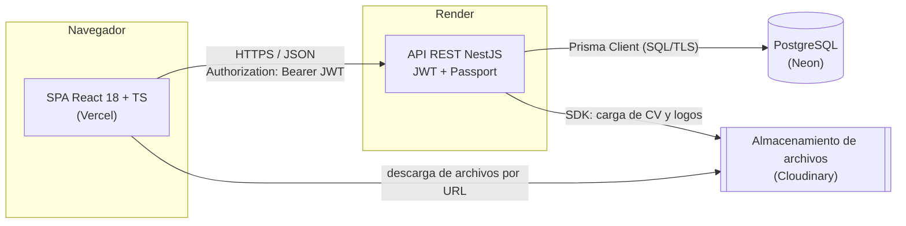
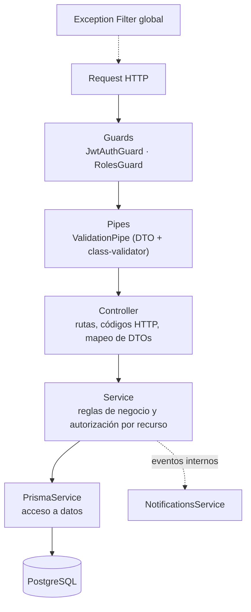
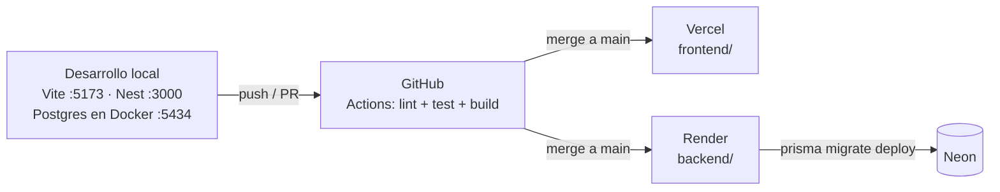

# Arquitectura del proyecto — Portal de Pasantías

## 1. Visión general

El sistema sigue una arquitectura **cliente-servidor desacoplada** de tres niveles:

1. **Cliente (SPA)** — aplicación React que se ejecuta en el navegador.
2. **API REST** — backend NestJS organizado como un **monolito modular en capas**.
3. **Base de datos** — PostgreSQL gestionado con Prisma ORM.

El cliente y la API se comunican exclusivamente por HTTP/JSON y se despliegan de forma independiente. Ambos viven en el **mismo repositorio** (monorepo con npm workspaces).



### ¿Por qué un monolito modular y no microservicios?

| Criterio | Monolito modular | Microservicios |
| --- | --- | --- |
| Tamaño del equipo (1 desarrollador) | Adecuado | Sobrecosto de operación y coordinación |
| Despliegue en planes gratuitos | 1 servicio en Render | N servicios, cada uno con su *cold start* |
| Transacciones (ej. registro = usuario + perfil) | Una transacción de base | Requiere coordinación distribuida |
| Separación por dominios | Módulos de NestJS con límites claros | Servicios independientes |

Los módulos de NestJS dan la separación por dominio que buscaríamos en microservicios (cada módulo expone solo sus *services* públicos), sin la complejidad operativa. Si en el futuro un dominio necesitara escalar aparte, los límites ya están definidos.

---

## 2. Arquitectura del backend (NestJS)

### 2.1 Capas

Cada módulo funcional (ver [listado de módulos](modulos.md)) respeta las mismas capas:



| Capa | Responsabilidad | No debe |
| --- | --- | --- |
| **Controller** | Definir endpoints REST, recibir/validar DTOs, devolver respuestas. | Contener lógica de negocio ni acceder a Prisma. |
| **Service** | Reglas de negocio (ej. "solo se puede postular a ofertas abiertas"), verificación de que el recurso pertenece al usuario, transacciones. | Conocer detalles HTTP (request/response). |
| **Acceso a datos** | `PrismaService` (singleton inyectable) con el cliente tipado generado del schema. | — |
| **DTOs** | Contratos de entrada/salida validados con `class-validator` y documentados con Swagger. | Exponer campos sensibles (ej. `password_hash`). |

Prisma ya cumple el rol de repositorio (cliente tipado por modelo), por lo que no se agrega una capa *repository* adicional para no duplicar código. Las consultas complejas (búsqueda de ofertas con filtros) se encapsulan en métodos del service.

### 2.2 Autenticación y autorización

- **Autenticación:** login con email + contraseña (bcrypt). La API emite un **JWT firmado (HS256)** con `sub` (id de usuario), `role` y expiración. El cliente lo envía en `Authorization: Bearer <token>`. No hay sesión en el servidor (*stateless*), lo que simplifica el despliegue en Render.
- **Autorización en dos niveles:**
  1. **Por rol** — `RolesGuard` + `@Roles('EMPLOYER')` en cada endpoint.
  2. **Por recurso** — en el service se verifica la pertenencia (ej. un empleador solo edita sus propias ofertas y solo ve postulantes de ellas).
- Las cuentas desactivadas por un administrador son rechazadas en la estrategia JWT aunque tengan un token vigente.

### 2.3 Estructura de carpetas planificada

```
backend/
├── prisma/
│   ├── schema.prisma          # modelo de datos (fuente de verdad)
│   └── migrations/            # migraciones generadas por Prisma
└── src/
    ├── main.ts                # bootstrap: ValidationPipe, CORS, Swagger
    ├── app.module.ts
    ├── common/                # guards, decorators, filters, pipes compartidos
    ├── config/                # carga y validación de variables de entorno
    ├── prisma/                # PrismaModule / PrismaService
    └── modules/
        ├── auth/              # M1
        ├── users/             # M2
        ├── students/          # M3
        ├── companies/         # M4
        ├── offers/            # M5
        ├── catalog/           # M6 (categorías y etiquetas)
        ├── applications/      # M7
        ├── notifications/     # M8
        ├── files/             # M9
        ├── messages/          # M10
        └── admin/             # M11
```

Cada carpeta de `modules/` contiene `*.module.ts`, `*.controller.ts`, `*.service.ts`, `dto/` y sus tests `*.spec.ts`.

### 2.4 Convenciones de la API

- Recursos en plural y en inglés: `/offers`, `/offers/:id/applications`, `/applications/:id/messages`, `/admin/users/:id/deactivate`.
- Prefijo global `/api` y documentación Swagger en `/api/docs`.
- Paginación con `?page=&limit=`; filtros por query string (`/offers?category=...&modality=REMOTE&type=INTERNSHIP`).
- Códigos HTTP estándar: `201` creación, `400` validación, `401` sin token, `403` rol/recurso no permitido, `404`, `409` conflicto (ej. postulación duplicada).

---

## 3. Arquitectura del frontend (React)

- **SPA** construida con **Vite**, con **React Router** para la navegación y rutas protegidas por rol (`/estudiante/*`, `/empresa/*`, `/admin/*`).
- **Organización por *features*** que replica los módulos del backend:

```
frontend/src/
├── app/            # router, providers, layout principal
├── api/            # cliente HTTP (fetch/axios) con interceptor del JWT
├── components/     # componentes de UI reutilizables
├── features/
│   ├── auth/
│   ├── offers/
│   ├── applications/
│   ├── profile/
│   ├── messages/
│   ├── notifications/
│   └── admin/
├── hooks/
└── types/
```

- **Estado del servidor:** TanStack Query (caché, reintentos, invalidación y *polling* para notificaciones y mensajes).
- **Formularios:** React Hook Form + Zod para validación en el cliente.
- **Estado de sesión:** contexto de React con el usuario autenticado y su rol.

---

## 4. Tecnologías definitivas

| Capa | Tecnología | Justificación |
| --- | --- | --- |
| Lenguaje | **TypeScript** (frontend y backend) | Un solo lenguaje en todo el stack; tipado estático que detecta errores en compilación y permite compartir convenciones entre cliente y servidor. |
| Frontend | **React 18** + **Vite** | Biblioteca UI más difundida del mercado; Vite ofrece arranque y *hot reload* rápidos. |
| Ruteo / datos (FE) | React Router, TanStack Query, React Hook Form + Zod | Estándares de facto; resuelven navegación, caché de datos remotos y validación de formularios sin escribir infraestructura propia. |
| Backend | **NestJS** | Arquitectura modular, inyección de dependencias y decoradores que imponen la separación en capas; integración oficial con Passport, JWT, Swagger y validación. |
| Validación (BE) | class-validator + class-transformer | Integración nativa con los `ValidationPipe` de NestJS. |
| Base de datos | **PostgreSQL 16** | Motor relacional robusto: el dominio es fuertemente relacional (usuarios, ofertas, postulaciones, mensajes) y necesita integridad referencial, restricciones únicas y transacciones. |
| ORM | **Prisma 7** | Schema declarativo como fuente de verdad, migraciones versionadas y cliente 100 % tipado generado a partir del modelo. |
| Autenticación | **JWT + Passport.js** (`@nestjs/jwt`, `passport-jwt`), bcrypt | Autenticación *stateless*, estándar para APIs REST y compatible con despliegue en servicios sin estado. |
| Documentación API | Swagger / OpenAPI (`@nestjs/swagger`) | Documentación generada desde el código; sirve como contrato entre frontend y backend. |
| Almacenamiento de archivos | **Cloudinary** (plan gratuito) | El disco de Render en plan gratuito es efímero y Neon tiene 0,5 GB; se guardan CV y logos fuera de la base. |
| Testing | Vitest + Supertest | Ya configurados en el backend; tests unitarios de services y e2e de endpoints. |
| Calidad | Oxlint + Prettier | Linter rápido y formato uniforme en todo el monorepo. |
| Deploy frontend | **Vercel** | Despliegue automático desde GitHub, HTTPS y CDN gratuitos. |
| Deploy backend | **Render** | Hosting de servicios Node.js con despliegue continuo desde GitHub. |
| Base en la nube | **Neon** | PostgreSQL *serverless* gratuito (0,5 GB), con *branching* para entornos de prueba. |
| Repositorio / CI | Git + GitHub (monorepo npm workspaces) + GitHub Actions | Requisito de la cátedra: un único repositorio; CI para lint, tests y build en cada PR. |

---

## 5. Entornos y despliegue



| Variable | Dónde | Uso |
| --- | --- | --- |
| `DATABASE_URL` | backend | Conexión a PostgreSQL (local o Neon). |
| `JWT_SECRET`, `JWT_EXPIRES_IN` | backend | Firma y duración de los tokens. |
| `CORS_ORIGIN` | backend | URL del frontend permitida. |
| `CLOUDINARY_URL` | backend | Credenciales del almacenamiento de archivos. |
| `VITE_API_URL` | frontend | URL base de la API. |

Las migraciones se aplican en Render con `prisma migrate deploy` como parte del *build*. Los secretos se configuran en los paneles de Render y Vercel, nunca en el repositorio (`.env` está en `.gitignore`; solo se versiona `.env.example`).

---

## 6. Almacenamiento de archivos

- Los CV (PDF) y logos se suben **a través del backend** (`multipart/form-data`), que valida tipo y tamaño antes de enviarlos a Cloudinary.
- En la base se guarda solo la URL resultante (`student_profiles.cv_url`, `companies.logo_url`) y, para el CV, el nombre original del archivo.
- Al postularse se copia la URL del CV vigente a `applications.cv_url`, para que la empresa vea el CV con el que se postuló el estudiante.

---

## 7. Seguridad

- Contraseñas con **bcrypt** (nunca en texto plano ni en respuestas de la API).
- Validación y *whitelisting* de todos los DTOs de entrada (`whitelist: true`, `forbidNonWhitelisted: true`).
- Prisma usa consultas parametrizadas (previene inyección SQL).
- CORS restringido al dominio del frontend; cabeceras de seguridad con Helmet.
- Límite de intentos en login (`@nestjs/throttler`).
- IDs UUID no enumerables en todas las URLs.
- Autorización por rol **y** por pertenencia del recurso en cada operación de escritura.
