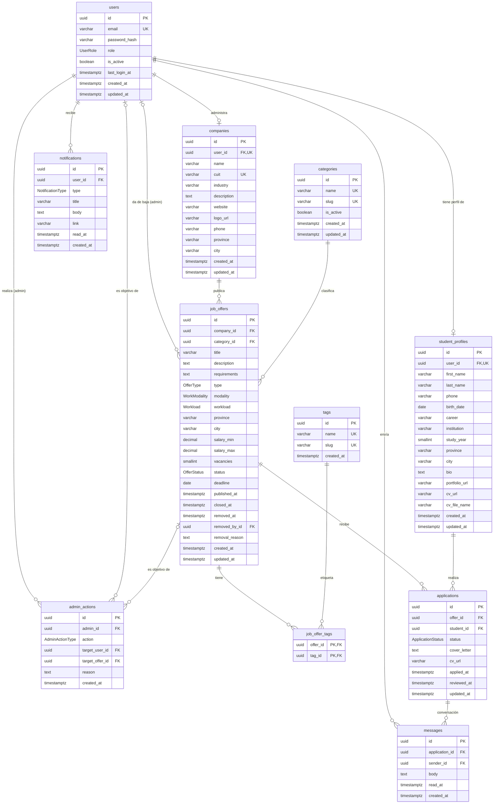

# Modelo de datos — Portal de Pasantías

**Motor:** PostgreSQL 16 (Neon en producción) · **ORM:** Prisma 7
**Fuente de verdad:** [`backend/prisma/schema.prisma`](../../backend/prisma/schema.prisma) · **DDL equivalente:** [`database/schema.sql`](../../database/schema.sql) · **Datos de prueba:** [`database/seed.sql`](../../database/seed.sql)

El modelo es **relacional** y está normalizado a 3FN. Tiene 11 tablas y 8 tipos enumerados.

---

## 1. Diagrama entidad-relación

> GitHub renderiza el diagrama automáticamente. También está exportado como imagen: [`der.png`](der.png) / [`der.svg`](der.svg).
> Notación: `PK` clave primaria, `FK` clave foránea, `UK` clave única. Tipos resumidos; los tamaños exactos están en el diccionario de datos.

---

## 2. Decisiones de diseño

| Decisión | Justificación |
| --- | --- |
| **Una tabla `users` para los tres roles** + tablas de perfil 1:1 (`student_profiles`, `companies`) | La autenticación (email, contraseña, estado, rol) es común a todos; los datos específicos de cada rol viven en su propia tabla. Evita columnas nulas masivas y permite un único flujo de login JWT. El administrador no necesita perfil adicional. |
| **Claves primarias UUID** (`gen_random_uuid()`) | Los IDs se exponen en la API REST y en URLs del frontend; los UUID no son enumerables (no revelan cantidad de registros ni permiten adivinar IDs ajenos). |
| **Enums nativos de PostgreSQL** para roles y estados | Restringen los valores válidos a nivel de base y Prisma los mapea a tipos TypeScript. |
| **La mensajería cuelga de `applications`** | Cada conversación es entre el empleador y un postulante sobre una oferta concreta. Así se evita el contacto no solicitado y la autorización es simple: solo el estudiante de la postulación y la empresa dueña de la oferta pueden leer o escribir. |
| **Baja lógica** de ofertas (`status = REMOVED`) y de cuentas (`is_active = false`) | La moderación del administrador no borra datos: las postulaciones y mensajes históricos se conservan y la acción es reversible. |
| **`admin_actions` como bitácora de moderación** | Deja trazabilidad de quién activó/desactivó una cuenta o dio de baja una publicación y por qué. |
| **`applications.cv_url`** (copia del CV al postularse) | Si el estudiante actualiza su CV, el empleador sigue viendo el CV con el que se postuló. |
| **Notificaciones internas** (tabla `notifications`) | La consigna pide notificar al estudiante al aprobar/rechazar; se resuelve dentro de la plataforma. Las notificaciones *push* están fuera de alcance. |
| **Archivos (CV, logo) fuera de la base** | Solo se guarda la URL; el archivo vive en el servicio de almacenamiento (ver [arquitectura](../arquitectura.md)). Neon gratuito ofrece 0,5 GB, que no conviene gastar en binarios. |
| **`timestamptz`** en todas las fechas con hora | Evita ambigüedades de zona horaria entre Render, Neon y el navegador. |

---

## 3. Diccionario de datos

### 3.1 Tipos enumerados

| Enum | Valores | Uso |
| --- | --- | --- |
| `UserRole` | `STUDENT`, `EMPLOYER`, `ADMIN` | Rol del usuario; define la autorización en toda la API. |
| `OfferType` | `INTERNSHIP`, `JOB` | Pasantía o empleo junior. |
| `WorkModality` | `ON_SITE`, `REMOTE`, `HYBRID` | Modalidad de trabajo (filtro de búsqueda). |
| `Workload` | `FULL_TIME`, `PART_TIME` | Carga horaria. |
| `OfferStatus` | `OPEN`, `CLOSED`, `REMOVED` | Abierta; cerrada por el empleador; dada de baja por el administrador. |
| `ApplicationStatus` | `PENDING`, `ACCEPTED`, `REJECTED`, `WITHDRAWN` | Estado de la postulación. `WITHDRAWN` = el estudiante la retiró. |
| `NotificationType` | `APPLICATION_RECEIVED`, `APPLICATION_STATUS_CHANGED`, `NEW_MESSAGE`, `OFFER_REMOVED`, `ACCOUNT_STATUS_CHANGED` | Evento que originó la notificación. |
| `AdminActionType` | `USER_ACTIVATED`, `USER_DEACTIVATED`, `OFFER_REMOVED`, `OFFER_RESTORED` | Acción de moderación registrada. |

### 3.2 `users` — cuentas de acceso

| Campo | Tipo | Nulo | Default | Descripción |
| --- | --- | --- | --- | --- |
| `id` | `UUID` | No | `gen_random_uuid()` | **PK** |
| `email` | `VARCHAR(255)` | No | | **UK**. Email de login. |
| `password_hash` | `VARCHAR(255)` | No | | Hash bcrypt. Nunca se guarda la contraseña en texto plano. |
| `role` | `UserRole` | No | | Rol del usuario. |
| `is_active` | `BOOLEAN` | No | `true` | `false` = cuenta desactivada por un administrador (no puede iniciar sesión). |
| `last_login_at` | `TIMESTAMPTZ` | Sí | | Último inicio de sesión. |
| `created_at` / `updated_at` | `TIMESTAMPTZ` | No | `now()` | Auditoría. |

### 3.3 `student_profiles` — perfil del estudiante (1:1 con `users`)

| Campo | Tipo | Nulo | Descripción |
| --- | --- | --- | --- |
| `id` | `UUID` | No | **PK** |
| `user_id` | `UUID` | No | **FK → users.id**, **UK** (garantiza 1:1). `ON DELETE CASCADE`. |
| `first_name`, `last_name` | `VARCHAR(100)` | No | Nombre y apellido. |
| `phone` | `VARCHAR(30)` | Sí | Teléfono de contacto. |
| `birth_date` | `DATE` | Sí | Fecha de nacimiento. |
| `career` | `VARCHAR(150)` | No | Carrera que cursa. |
| `institution` | `VARCHAR(150)` | No | Institución educativa. |
| `study_year` | `SMALLINT` | Sí | Año de cursado. |
| `province`, `city` | `VARCHAR(100)` | Sí | Ubicación. |
| `bio` | `TEXT` | Sí | Presentación personal. |
| `portfolio_url` | `VARCHAR(500)` | Sí | Portfolio / repositorio personal. |
| `cv_url` | `VARCHAR(500)` | Sí | URL del CV (PDF) en el almacenamiento de archivos. |
| `cv_file_name` | `VARCHAR(255)` | Sí | Nombre original del archivo. |
| `created_at` / `updated_at` | `TIMESTAMPTZ` | No | Auditoría. |

### 3.4 `companies` — perfil de la empresa (1:1 con `users` de rol `EMPLOYER`)

| Campo | Tipo | Nulo | Descripción |
| --- | --- | --- | --- |
| `id` | `UUID` | No | **PK** |
| `user_id` | `UUID` | No | **FK → users.id**, **UK**. `ON DELETE CASCADE`. |
| `name` | `VARCHAR(150)` | No | Razón social / nombre comercial. |
| `cuit` | `VARCHAR(13)` | No | **UK**. CUIT con formato `XX-XXXXXXXX-X`. |
| `industry` | `VARCHAR(100)` | Sí | Rubro. |
| `description` | `TEXT` | Sí | Descripción de la empresa. |
| `website`, `logo_url` | `VARCHAR(500)` | Sí | Sitio web y logo. |
| `phone` | `VARCHAR(30)` | Sí | Teléfono. |
| `province`, `city` | `VARCHAR(100)` | Sí | Ubicación. |
| `created_at` / `updated_at` | `TIMESTAMPTZ` | No | Auditoría. |

### 3.5 `categories` — categorías de ofertas (ABM del administrador)

| Campo | Tipo | Nulo | Descripción |
| --- | --- | --- | --- |
| `id` | `UUID` | No | **PK** |
| `name` | `VARCHAR(100)` | No | **UK**. Nombre visible. |
| `slug` | `VARCHAR(120)` | No | **UK**. Identificador para URLs y filtros. |
| `is_active` | `BOOLEAN` | No | Una categoría inactiva no se ofrece al publicar, pero las ofertas existentes la conservan. |
| `created_at` / `updated_at` | `TIMESTAMPTZ` | No | Auditoría. |

### 3.6 `tags` — etiquetas de búsqueda (ABM del administrador)

| Campo | Tipo | Nulo | Descripción |
| --- | --- | --- | --- |
| `id` | `UUID` | No | **PK** |
| `name` | `VARCHAR(60)` | No | **UK**. Ej.: "React", "SQL", "Inglés". |
| `slug` | `VARCHAR(80)` | No | **UK**. |
| `created_at` | `TIMESTAMPTZ` | No | Auditoría. |

### 3.7 `job_offers` — ofertas laborales y de pasantía

| Campo | Tipo | Nulo | Default | Descripción |
| --- | --- | --- | --- | --- |
| `id` | `UUID` | No | `gen_random_uuid()` | **PK** |
| `company_id` | `UUID` | No | | **FK → companies.id**. `ON DELETE CASCADE`. |
| `category_id` | `UUID` | No | | **FK → categories.id**. `ON DELETE RESTRICT` (no se puede borrar una categoría en uso). |
| `title` | `VARCHAR(150)` | No | | Título del puesto. |
| `description` | `TEXT` | No | | Descripción de tareas. |
| `requirements` | `TEXT` | Sí | | Requisitos. |
| `type` | `OfferType` | No | | Pasantía / empleo. |
| `modality` | `WorkModality` | No | | Presencial / remoto / híbrido. |
| `workload` | `Workload` | No | | Jornada completa / parcial. |
| `province`, `city` | `VARCHAR(100)` | Sí | | Ubicación (nula si es 100 % remota). |
| `salary_min`, `salary_max` | `DECIMAL(12,2)` | Sí | | Rango de remuneración (opcional). |
| `vacancies` | `SMALLINT` | No | `1` | Cantidad de puestos. |
| `status` | `OfferStatus` | No | `OPEN` | Estado de la oferta. |
| `deadline` | `DATE` | Sí | | Fecha límite para postularse. |
| `published_at` | `TIMESTAMPTZ` | No | `now()` | Fecha de publicación. |
| `closed_at` | `TIMESTAMPTZ` | Sí | | Cuándo la cerró el empleador. |
| `removed_at` | `TIMESTAMPTZ` | Sí | | Cuándo la dio de baja un administrador. |
| `removed_by_id` | `UUID` | Sí | | **FK → users.id** (administrador). `ON DELETE SET NULL`. |
| `removal_reason` | `TEXT` | Sí | | Motivo de la baja (se informa al empleador). |
| `created_at` / `updated_at` | `TIMESTAMPTZ` | No | `now()` | Auditoría. |

### 3.8 `job_offer_tags` — relación N:M entre ofertas y etiquetas

| Campo | Tipo | Nulo | Descripción |
| --- | --- | --- | --- |
| `offer_id` | `UUID` | No | **PK compuesta**, **FK → job_offers.id**. `ON DELETE CASCADE`. |
| `tag_id` | `UUID` | No | **PK compuesta**, **FK → tags.id**. `ON DELETE CASCADE`. |

### 3.9 `applications` — postulaciones

| Campo | Tipo | Nulo | Default | Descripción |
| --- | --- | --- | --- | --- |
| `id` | `UUID` | No | `gen_random_uuid()` | **PK** |
| `offer_id` | `UUID` | No | | **FK → job_offers.id**. `ON DELETE CASCADE`. |
| `student_id` | `UUID` | No | | **FK → student_profiles.id**. `ON DELETE CASCADE`. |
| `status` | `ApplicationStatus` | No | `PENDING` | Estado de la postulación. |
| `cover_letter` | `TEXT` | Sí | | Mensaje de presentación. |
| `cv_url` | `VARCHAR(500)` | Sí | | Copia de la URL del CV al momento de postularse. |
| `applied_at` | `TIMESTAMPTZ` | No | `now()` | Fecha de postulación. |
| `reviewed_at` | `TIMESTAMPTZ` | Sí | | Cuándo el empleador aceptó/rechazó. |
| `updated_at` | `TIMESTAMPTZ` | No | `now()` | Auditoría. |

**Restricción única** `(offer_id, student_id)`: un estudiante se postula una sola vez por oferta.

### 3.10 `messages` — mensajería interna

| Campo | Tipo | Nulo | Descripción |
| --- | --- | --- | --- |
| `id` | `UUID` | No | **PK** |
| `application_id` | `UUID` | No | **FK → applications.id**. Hilo de la conversación. `ON DELETE CASCADE`. |
| `sender_id` | `UUID` | No | **FK → users.id**. Autor (estudiante o empleador). |
| `body` | `TEXT` | No | Contenido. |
| `read_at` | `TIMESTAMPTZ` | Sí | Cuándo lo leyó el destinatario (nulo = no leído). |
| `created_at` | `TIMESTAMPTZ` | No | Fecha de envío. |

### 3.11 `notifications` — notificaciones internas

| Campo | Tipo | Nulo | Descripción |
| --- | --- | --- | --- |
| `id` | `UUID` | No | **PK** |
| `user_id` | `UUID` | No | **FK → users.id**. Destinatario. `ON DELETE CASCADE`. |
| `type` | `NotificationType` | No | Evento de origen. |
| `title` | `VARCHAR(150)` | No | Título breve. |
| `body` | `TEXT` | Sí | Detalle. |
| `link` | `VARCHAR(500)` | Sí | Ruta del frontend a la que lleva la notificación. |
| `read_at` | `TIMESTAMPTZ` | Sí | Nulo = no leída. |
| `created_at` | `TIMESTAMPTZ` | No | Fecha. |

### 3.12 `admin_actions` — bitácora de moderación

| Campo | Tipo | Nulo | Descripción |
| --- | --- | --- | --- |
| `id` | `UUID` | No | **PK** |
| `admin_id` | `UUID` | No | **FK → users.id** (administrador). `ON DELETE RESTRICT`. |
| `action` | `AdminActionType` | No | Acción realizada. |
| `target_user_id` | `UUID` | Sí | **FK → users.id**. Cuenta afectada. `ON DELETE SET NULL`. |
| `target_offer_id` | `UUID` | Sí | **FK → job_offers.id**. Oferta afectada. `ON DELETE SET NULL`. |
| `reason` | `TEXT` | Sí | Motivo. |
| `created_at` | `TIMESTAMPTZ` | No | Fecha. |

---

## 4. Relaciones

| Relación | Cardinalidad | Implementación |
| --- | --- | --- |
| Usuario — Perfil de estudiante | 1 : 0..1 | `student_profiles.user_id` UNIQUE |
| Usuario — Empresa | 1 : 0..1 | `companies.user_id` UNIQUE |
| Empresa — Oferta | 1 : N | `job_offers.company_id` |
| Categoría — Oferta | 1 : N | `job_offers.category_id` |
| Oferta — Etiqueta | N : M | tabla intermedia `job_offer_tags` |
| Oferta — Postulación | 1 : N | `applications.offer_id` |
| Estudiante — Postulación | 1 : N | `applications.student_id` |
| Postulación — Mensaje | 1 : N | `messages.application_id` |
| Usuario — Mensaje (autor) | 1 : N | `messages.sender_id` |
| Usuario — Notificación | 1 : N | `notifications.user_id` |
| Administrador — Acción de moderación | 1 : N | `admin_actions.admin_id` |

---

## 5. Índices principales

Además de los índices implícitos de cada PK:

| Tabla | Índice | Tipo | Consulta que optimiza |
| --- | --- | --- | --- |
| `users` | `(email)` | UNIQUE | Login y control de email duplicado. |
| `users` | `(role, is_active)` | B-tree | Listado de usuarios por rol/estado en el panel de administración. |
| `student_profiles` | `(user_id)` | UNIQUE | Relación 1:1; perfil del usuario autenticado. |
| `student_profiles` | `(career)` | B-tree | Filtrado de postulantes por carrera. |
| `companies` | `(user_id)`, `(cuit)` | UNIQUE | Relación 1:1; empresa duplicada. |
| `companies` | `(name)` | B-tree | Búsqueda de empresas en el panel de administración. |
| `categories`, `tags` | `(name)`, `(slug)` | UNIQUE | Evitar duplicados; filtro por slug. |
| `job_offers` | `(status, published_at DESC)` | B-tree | **Listado público de ofertas abiertas, más recientes primero** (consulta más frecuente). |
| `job_offers` | `(company_id, status)` | B-tree | "Mis ofertas" del empleador. |
| `job_offers` | `(category_id)` | B-tree | Filtro por categoría. |
| `job_offers` | `(type, modality)` | B-tree | Filtros por tipo y modalidad. |
| `job_offers` | `(province, city)` | B-tree | Filtro por ubicación. |
| `job_offer_tags` | `(offer_id, tag_id)` | PK | Etiquetas de una oferta. |
| `job_offer_tags` | `(tag_id)` | B-tree | Ofertas con una etiqueta dada. |
| `applications` | `(offer_id, student_id)` | UNIQUE | Evita postulaciones duplicadas. |
| `applications` | `(offer_id, status)` | B-tree | Postulantes de una oferta, por estado. |
| `applications` | `(student_id, status)` | B-tree | "Mis postulaciones" del estudiante. |
| `messages` | `(application_id, created_at)` | B-tree | Hilo de mensajes en orden cronológico. |
| `notifications` | `(user_id, read_at, created_at DESC)` | B-tree | Bandeja de notificaciones y contador de no leídas. |
| `admin_actions` | `(admin_id, created_at DESC)`, `(target_user_id)`, `(target_offer_id)` | B-tree | Historial de moderación. |

---

## 6. Reglas de negocio que se validan en la capa de servicios

Algunas reglas no se expresan como restricciones de la base y las controla el backend (NestJS):

- Un usuario `STUDENT` solo puede tener `student_profiles`; un `EMPLOYER` solo `companies`; un `ADMIN` ninguno.
- Solo se puede postular a ofertas con `status = OPEN` y `deadline` no vencida.
- Solo la empresa dueña de la oferta puede cambiar el estado de sus postulaciones; al pasar a `ACCEPTED`/`REJECTED` se completa `reviewed_at` y se crea una `notification` para el estudiante.
- `salary_min <= salary_max` cuando ambos están presentes.
- En `messages`, el `sender_id` debe ser el estudiante de la postulación o el usuario de la empresa dueña de la oferta.
- Un usuario con `is_active = false` no puede autenticarse.
- Toda baja/restauración de oferta y toda activación/desactivación de cuenta genera un registro en `admin_actions`.
