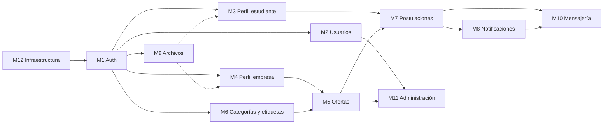

# Listado de módulos — Portal de Pasantías

Cada módulo funcional se corresponde con un **módulo de NestJS** en el backend (`backend/src/modules/<nombre>`) y con una **sección de páginas** en el frontend (`frontend/src/features/<nombre>`). Se desarrolla en su propia rama (`feature/<nombre>`) y se integra a `main` mediante pull request.

## Escala de prioridades

| Prioridad | Significado |
| --- | --- |
| **Alta** | Imprescindible para el MVP: sin este módulo el flujo principal (empresa publica → estudiante se postula → empresa responde) no funciona. |
| **Media** | Completa la propuesta aprobada en la 1.ª entrega; se desarrolla una vez estable el flujo principal. |
| **Baja** | Mejora de calidad o soporte; se hace si el cronograma lo permite, sin comprometer la entrega final. |

## Resumen

| # | Módulo | Rol/es | Prioridad | Tablas principales | Depende de |
| --- | --- | --- | --- | --- | --- |
| M1 | Autenticación y autorización | Todos | **Alta** | `users` | — |
| M2 | Gestión de usuarios y cuentas | Todos | **Alta** | `users` | M1 |
| M3 | Perfil del estudiante | Estudiante | **Alta** | `student_profiles` | M1, M9 |
| M4 | Perfil de la empresa | Empleador | **Alta** | `companies` | M1, M9 |
| M5 | Ofertas laborales y pasantías | Empleador, Estudiante | **Alta** | `job_offers`, `job_offer_tags` | M4, M6 |
| M6 | Categorías y etiquetas | Administrador | **Alta** | `categories`, `tags` | M1 |
| M7 | Postulaciones | Estudiante, Empleador | **Alta** | `applications` | M3, M5 |
| M8 | Notificaciones | Estudiante, Empleador | **Media** | `notifications` | M7 |
| M9 | Almacenamiento de archivos (CV y logos) | Estudiante, Empleador | **Media** | — (URLs en perfiles) | M1 |
| M10 | Mensajería interna | Estudiante, Empleador | **Media** | `messages` | M7, M8 |
| M11 | Panel de administración y moderación | Administrador | **Media** | `users`, `job_offers`, `admin_actions` | M2, M5 |
| M12 | Transversal: infraestructura, calidad y despliegue | — | **Alta** | — | — |

> M3/M4 pueden desarrollarse sin M9 (el CV/logo se agrega después); por eso M9 tiene prioridad media aunque los perfiles sean de prioridad alta.

---

## Detalle de módulos

### M1 — Autenticación y autorización · Prioridad **Alta**

Registro e inicio de sesión para los tres roles, con autenticación **stateless** mediante JWT.

- Registro de estudiante y de empleador (crea el `user` y su perfil inicial en una misma transacción). Los administradores se crean por seed/script, no por registro público.
- Login con email y contraseña (hash con bcrypt); emite un JWT con `sub`, `role` y expiración.
- Estrategia `passport-jwt` + `JwtAuthGuard` global; decorador `@Public()` para endpoints abiertos (listado de ofertas, login, registro).
- `RolesGuard` + decorador `@Roles(...)` para restringir endpoints por rol.
- Rechazo de login y de tokens de cuentas desactivadas (`is_active = false`), y de login de cuentas con el email sin verificar (ver M2).
- Endpoint `GET /auth/me` con los datos del usuario autenticado.
- **Frontend:** páginas de login y registro, almacenamiento del token, rutas protegidas por rol.

### M2 — Gestión de usuarios y cuentas · Prioridad **Alta**

Operaciones sobre la cuenta propia y consultas de usuarios que usan otros módulos.

- Cambio de contraseña del usuario autenticado (pide la contraseña actual; se avisa por email).
- Cambio de email en dos pasos: se pide la contraseña actual, se envía un enlace de confirmación a la dirección **nueva** y el email recién cambia cuando ese enlace se abre. Se avisa a la dirección anterior.
- **Verificación de email:** al registrarse (M1) se envía un enlace de verificación; la cuenta no puede iniciar sesión hasta abrirlo. Incluye reenvío del enlace.
- Envío de emails por la API de Brevo (`MailModule`), con textos en inglés y español.
- Servicio interno de usuarios (búsqueda por id/email, verificación de estado) reutilizado por M1 y M11.

### M3 — Perfil del estudiante · Prioridad **Alta**

- Ver y editar datos personales y de contacto, carrera, institución, año de cursado, ubicación, presentación y portfolio.
- Subir, reemplazar y eliminar el CV en PDF (usa M9).
- Vista pública del perfil del estudiante para las empresas a las que se postuló.

### M4 — Perfil de la empresa · Prioridad **Alta**

- Ver y editar razón social, CUIT, rubro, descripción, sitio web, contacto y ubicación.
- Subir el logo de la empresa (usa M9).
- Página pública de la empresa con sus ofertas abiertas.

### M5 — Ofertas laborales y pasantías · Prioridad **Alta**

Núcleo del portal.

- **Empleador:** crear, editar y cerrar ofertas; asignar categoría y etiquetas; listado "Mis ofertas" con cantidad de postulantes por oferta.
- **Estudiante / visitante:** listado público de ofertas abiertas con **búsqueda por texto** (título/descripción) y **filtros** por categoría, etiquetas, tipo (pasantía/empleo), modalidad, carga horaria y ubicación; paginación y orden por fecha.
- Detalle de oferta con datos de la empresa.
- Las ofertas dadas de baja por un administrador (`REMOVED`) no aparecen en el listado público.

### M6 — Categorías y etiquetas · Prioridad **Alta**

- ABM de categorías (alta, edición, activar/desactivar) y de etiquetas, reservado al administrador.
- Endpoints públicos de lectura para poblar los filtros y formularios del frontend.
- Se considera de prioridad alta porque M5 depende de que existan categorías; el seed carga un conjunto inicial.

### M7 — Postulaciones · Prioridad **Alta**

- **Estudiante:** postularse a una oferta abierta con un mensaje de presentación opcional (se toma una copia de la URL de su CV); ver "Mis postulaciones" con su estado (pendiente / aceptada / rechazada); retirar una postulación pendiente.
- **Empleador:** ver los postulantes de cada oferta (con acceso a su perfil y CV), filtrar por estado, **aceptar o rechazar** postulaciones.
- Validaciones: una sola postulación por estudiante y oferta, solo a ofertas abiertas y vigentes, solo la empresa dueña puede cambiar el estado.
- Cada cambio de estado dispara una notificación (M8).

### M8 — Notificaciones · Prioridad **Media**

Notificaciones **internas** de la plataforma (no push, fuera de alcance).

- Se generan ante: nueva postulación (al empleador), cambio de estado de una postulación (al estudiante), nuevo mensaje, baja de una oferta por moderación (al empleador) y cambio de estado de la cuenta.
- Bandeja de notificaciones, contador de no leídas, marcar como leída / marcar todas.
- **Frontend:** ícono con contador en la barra de navegación, consultado periódicamente (polling).

### M9 — Almacenamiento de archivos · Prioridad **Media**

- Carga de archivos a un servicio externo de almacenamiento (ver [arquitectura](arquitectura.md#6-almacenamiento-de-archivos)); en la base solo se guarda la URL.
- Validación de tipo y tamaño: CV solo PDF (máx. 5 MB); logo JPG/PNG/WebP (máx. 2 MB).
- Reemplazo y eliminación del archivo anterior.

### M10 — Mensajería interna · Prioridad **Media**

- Conversación entre el empleador y el estudiante **asociada a una postulación**.
- Enviar mensajes, listar el hilo en orden cronológico, marcar como leídos.
- Bandeja con las conversaciones del usuario y cantidad de mensajes no leídos.
- Solo participan el estudiante de la postulación y la empresa dueña de la oferta.
- Actualización por polling (no se usan WebSockets en esta versión).

### M11 — Panel de administración y moderación · Prioridad **Media**

- Vista general con métricas básicas (cantidad de estudiantes, empresas, ofertas abiertas y postulaciones).
- Listado y búsqueda de usuarios y empresas; **activar / desactivar cuentas**.
- Listado de publicaciones; **dar de baja** (con motivo) y restaurar ofertas.
- Acceso a la gestión de categorías y etiquetas (M6).
- Todas las acciones quedan registradas en `admin_actions` y notifican al afectado.

### M12 — Transversal: infraestructura, calidad y despliegue · Prioridad **Alta**

No es un módulo funcional, pero se planifica como tal porque condiciona a todos los demás.

- Módulo `PrismaModule` compartido (acceso a la base), configuración por variables de entorno, validación global de DTOs, manejo uniforme de errores.
- Documentación de la API con Swagger (OpenAPI) en `/api/docs`.
- Seed de datos de prueba.
- Tests unitarios de servicios críticos (auth, postulaciones) y tests e2e de los flujos principales.
- CI con GitHub Actions (lint + tests + build) y despliegue: frontend en Vercel, backend en Render, base en Neon.

---

## Orden de desarrollo propuesto

| Etapa | Módulos | Resultado |
| --- | --- | --- |
| 1. Base | M12, M1, M2, M6 | API con login/registro por rol, base migrada y catálogos cargados. |
| 2. Flujo principal (MVP) | M3, M4, M5, M7 | Una empresa publica, un estudiante busca y se postula, la empresa acepta/rechaza. |
| 3. Comunicación | M8, M9, M10 | Notificaciones, CV/logos y mensajería. |
| 4. Administración y cierre | M11, M12 (CI, tests, deploy) | Moderación, despliegue productivo, informe y video. |

## Distribución del trabajo

El proyecto lo desarrolla un único integrante (Thomas Reynoso), que implementa cada módulo de punta a punta (backend + frontend) siguiendo el orden de etapas anterior. Así cada etapa deja un flujo funcionando antes de pasar a la siguiente, y los módulos de prioridad media pueden recortarse sin afectar el MVP si el cronograma lo exige.
